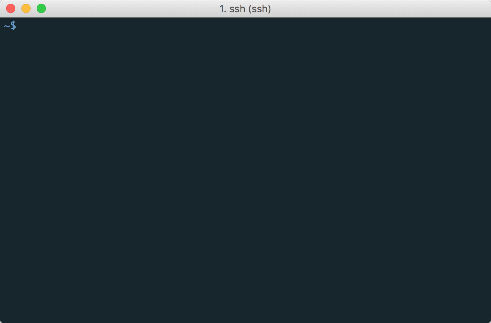

# greps

`grep` for the streaming age.

It counts and displays the skipped lines, highlights matches.

## Install

    go get github.com/dejan/greps/cmd/greps

## Usage

Just pipe some stream of data to it:

    tail -f /var/log/nginx/access.log | greps ohai

